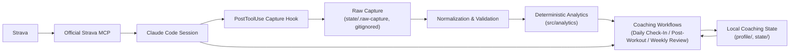

# Personal Trainer Agent

A personal fitness coaching agent built inside Claude Code that connects to real Strava workout history through Strava's official MCP integration, combines it with locally-stored athlete context (goals, schedule, injury status, ongoing coaching state), and reasons about training decisions the way a human coach would — while keeping every numeric calculation in deterministic code instead of asking an LLM to do arithmetic in its head.

## Why I Built It

I wanted to learn Claude Code and AI-agent engineering hands-on, and I didn't want to learn it through a tutorial project I'd throw away. So I built something I'd actually use: a coach for my own training, working from my own real Strava history, that had to survive contact with genuinely messy real-world fitness data — corrupted GPS records, treadmill syncs with contradictory fields, missing heart-rate streams — not a clean synthetic dataset. Every architectural decision in this repo came out of a real problem the data surfaced, not a hypothetical one.

Unlike a chatbot wrapper around an LLM, every coaching workflow here follows a documented decision process with structured, versioned output, and every number comes from tested code — never from the model generating a plausible-looking figure.

## What It Does

- **Strava workout retrieval** — reads runs, rides, walks, and strength sessions through Strava's official MCP tools (read-only; this project never writes to Strava).
- **Daily Check-In** — a short conversational check-in (fatigue, knee status, sleep, time available) combined with recent Strava history and standing athlete context to recommend today's session.
- **Post-Workout Review** — closes the loop after a completed workout: compares it against what was recommended, captures subjective signals, and decides whether it needs to shape future sessions.
- **Weekly Review** — steps back to a 7-day observation window to recognize patterns across sessions (displaced session types, stacked hard efforts, recurring soreness) without ever doing cross-session arithmetic by hand.
- **Carry-forward context** — unresolved concerns from a review persist as live state and get weighed by the next relevant check-in or review, with explicit rules for what kind of evidence is allowed to resolve each one.
- **Deterministic analytics** — two numeric metrics (trailing running distance, trailing running Zone 2 time) computed entirely in code, never estimated by Claude.

## Architecture

Claude Code is the agent runtime. Strava is treated strictly as an external tool queried live through its official MCP server — never a REST API this project pulls from and stores on its own. Everything Strava doesn't know about (goals, subjective fatigue, injuries, coaching decisions) lives in local Markdown files that Claude reads and writes as part of each workflow.

A `PostToolUse`/`PostToolUseFailure` hook captures every Strava MCP response verbatim to a gitignored local directory the moment it returns — deterministic code reads only from there, never from numbers retyped by Claude. This matters most for large responses: once a tool response exceeds the harness's token budget, Claude's own context receives a truncation notice, not the data — so for exactly the payloads where manual transcription risk would be highest, Claude structurally never sees the full numbers at all. That behavior was confirmed experimentally, not assumed.

## Core Engineering Principles

**Code calculates. Claude reasons.** Every numeric calculation — weekly mileage, HR-zone time, rolling windows — is a pure, tested function in `src/analytics/`. Claude's job is to call it, read the structured result, and make the coaching judgment call. For example, Claude never says "roughly 20 miles this week" from eyeballing activity list — it runs `run-trailing-running-distance.js` and reports exactly what the structured JSON says, including what was excluded and why.

**Validate before calculating.** A metric never gets one global "valid" flag. Validity is checked at three levels for every (activity, field, metric) triple: did retrieval actually succeed (vs. a partial/paginated response silently treated as complete), is the specific field structurally plausible for this activity, and does this metric even apply to this activity's type. A treadmill run can be invalid for distance and valid for HR Zone 2 time in the same breath — eligibility is metric-specific, not activity-specific.

## Handling Real-World Workout Data

This is the part of the project that most shaped the architecture, because the problems were real, discovered by inspecting actual captured Strava responses, not designed in from a spec:

- **A treadmill run with `distance: 0` and `moving_time: 2`** looked structurally broken — this originally justified excluding all `is_trainer: true` activities from the distance metric entirely.
- **That exclusion turned out to be wrong.** A later Technogym Skillrun treadmill sync arrived with a perfectly valid `distance`, `moving_time`, `avg_speed`, and `avg_cadence` — proving `is_trainer` was never real evidence about distance quality, just a proxy that happened to correlate with one broken record. The eligibility gate was rewritten around the actual `moving_time`/`distance` evidence instead.
- **A GPS-tagged outdoor run** claimed a 2.85-mile run in its own description but reported `distance: 41.9m` and `moving_time: 8s` in its structured summary — proof that `is_trainer: false` (outdoor/GPS) is no more trustworthy by default than `is_trainer: true`.
- **Free-text descriptions that mention heart rate numbers must never override the structured `has_heartrate` flag.** An activity can describe real HR values in its notes while its actual HR stream is absent — the metric treats HR as unavailable whenever the structured signal says so, regardless of what the description claims.
- **Metric-specific eligibility, proven concretely**: the same treadmill run that's `invalid` for the distance metric (`distance: 0`) is fully `eligible` for the Zone 2 time metric, because it has a real HR stream. One activity, two different eligibility verdicts, from two different metrics — the architectural proof that eligibility can never be a single per-activity flag.
- **Partial analytics coverage is reported, never smoothed over.** If one run in a window is excluded, the result is explicitly `partial` with the excluded activity and its reason listed — never a clean-looking number that quietly drops a data point.
- **Duplicate retrieval handling.** Overlapping captures (re-fetches, pagination overlap) are deduplicated by activity ID, with the most recently *captured* version winning — verified not to double-count.
- **Silent pagination gaps.** A `list_activities` response with `has_next_page: true` had, for months, been treated as a complete activity list purely by luck (it happened to contain everything relevant). That's now enforced in code: a retrieval isn't considered complete until at least one page in the sequence proves it reached the end.

## Deterministic Analytics

Two metrics are implemented under `src/analytics/`, each locked behind a written contract before implementation:

- **`trailing_running_distance`** — validated running mileage over a trailing 168-hour window, computed from Strava's summary fields with a `moving_time` plausibility floor that two real corrupted records justified.
- **`trailing_running_hr_zone2_time`** — time spent in the athlete's configured Zone 2 heart-rate range over the same trailing window, computed from time-series HR streams attributed against live `get_athlete_zones` configuration.

Both return structured results with an explicit `coverage.status` (`complete` / `partial` / `empty` / `retrieval_failed` / `config_invalid`) and an `exclusions` list — never a bare number standing in for a possibly-incomplete picture.

## Coaching Workflows

- **Daily Check-In** — the entry point. Infers rotation position from recent Strava history, applies a qualitative safety gate against injury/fatigue signals, and produces a structured recommendation with explicit reasoning split by source (Strava / profile / today's check-in).
- **Post-Workout Review** — single-session, closing-the-loop only. Compares a completed workout against what was recommended (if anything), and only creates persistent state when a concern genuinely needs to shape a future session.
- **Weekly Review** — pattern recognition across a 7-day window using only session-level facts and qualitative comparison — explicitly forbidden from doing cross-session arithmetic (no mileage totals, no averages, no % change) until deterministic analytics existed to do that safely.

Each workflow has a distinct responsibility and a distinct boundary on what it's allowed to compute, so the three never duplicate each other's judgment.

See [`state/examples/`](state/examples/) for a full sanitized walkthrough — a Daily Check-In, the workout it recommends, the resulting Post-Workout Review, and the carry-forward item it creates — using fabricated data, since this project's real coaching history isn't published (see Privacy below).

## Testing & Validation

**73 automated tests**, all passing (`node --test tests/*.test.js`), covering:

- Synthetic fixtures for boundary conditions (window edges, HR-zone boundaries, malformed configs, retrieval failures).
- Sanitized real fixtures — actual captured Strava responses with location/GPS and gear fields stripped, each documented with what real problem it represents.
- Real historical backtesting across 3 real historical windows against actual training data.
- Regression coverage tied to versioned `metricVersion`/`schemaVersion` fields, so a changed eligibility rule is traceable rather than a silent behavior change.
- Explicit corrupted/missing-data cases: zero-distance treadmill runs, GPS-failure outdoor runs, missing HR streams, malformed zone configuration.

## Privacy

- Raw Strava API responses are captured to `state/.raw-capture/`, which is gitignored and never committed.
- Real daily check-ins and workout reviews (`state/checkins/`, `state/reviews/`) are also gitignored — this repo's actual coaching history is never published. `state/examples/` demonstrates the same file formats with fabricated data instead.
- Streams are requested minimally — the Zone 2 metric requests exactly `["time", "heart_rate", "moving"]` and never `location`, `distance`, `velocity`, or `altitude`.
- Test fixtures built from real captures are sanitized before being committed — location, gear, and raw activity-ID fields are stripped or replaced with synthetic placeholders, and each sanitized fixture documents what was changed and why.

## Project Status

**Version 1.0 — Complete.**

## Future Possibilities

Kept deliberately out of V1 scope, not presented as unfinished requirements:

- Persistent SQLite state, if file-based per-day Markdown state eventually shows real limits at higher usage volume.
- Richer strength-programming support beyond what the current workflows cover.
- Packaged Claude Code Skills for the coaching workflows.
- A standalone application or chat-based interface.

---

This is also a learning project for Claude Code and AI-agent development — see [`CLAUDE.md`](CLAUDE.md) for the full working rules and phase-by-phase history.
